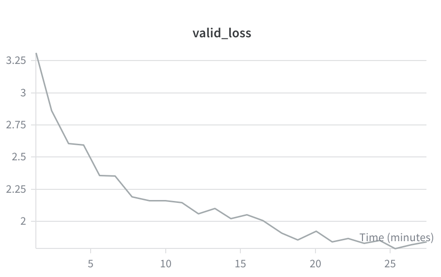
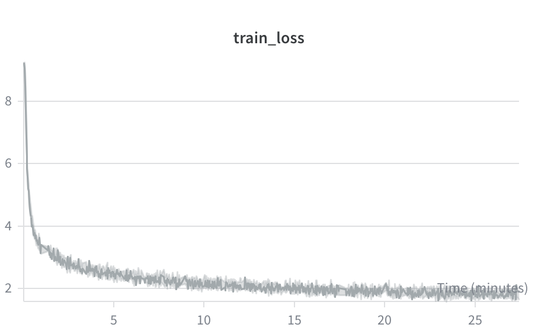

# LLM from Scratch

A GPT-style decoder language model implemented **from scratch in PyTorch** — no `transformers`, no `torch.nn.TransformerDecoder`, not even a `torch.nn.Linear`, no pre-built tokenizers. Based on [Stanford CS336: Language Modeling from Scratch](https://stanford-cs336.github.io/) (Assignment 1), implemented independently.

## What's implemented

- **BPE tokenizer** coded and trained from scratch (byte-level, with special-token handling and parallelized pre-tokenization)
- **Transformer decoder LM**: causal multi-head self-attention, RoPE positional embeddings, RMSNorm, SwiGLU feed-forward
- **Training infrastructure**: AdamW optimizer (from scratch), cosine learning-rate schedule with warmup, gradient clipping, checkpointing, memory-efficient data loading via `np.memmap`
- **Text generation** with temperature scaling and top-p (nucleus) sampling

All components pass the course's official test suite (`uv run pytest`).

## Results

Trained a small decoder LM on [TinyStories](https://huggingface.co/datasets/roneneldan/TinyStories) — entirely on a MacBook (Apple Silicon, `mps` backend), no GPU cluster required:

| | |
|---|---|
| Architecture | 4 layers, d_model 512, 16 heads, d_ff 1344, context length 256 |
| Training | 5,000 steps, batch size 16, ~27 minutes on `mps` |
| Schedule | cosine LR (1e-3 → 2e-5, 100 warmup steps) |
| Final loss | train 1.88, **validation 1.84** (best 1.79 @ step 4600) |

Validation loss descended smoothly from 3.31 to 1.84 with no sign of overfitting:





### Watching the model learn

Generations at increasing training steps show grammar arriving before coherence:

**Step 200** — the English syntax is there, but no coherence:

> Once upon a time, there was a little boy named Tim. Tim was big, can get you make colors?" Tim said, "Yes, can come to help you. I have to play with your ball!"

**Step 1200** — some coherence, but drifting away:

> One day, Sue went to the park with her mom. She was very happy. But when her ball went away, it was time to go home. Sue was sad and started to cry. Her mom said, "Don't worry, Sue. We will get our ball back." Sue went to her room and started to wash her ball.

**Step 5000** — Better, but still far from perfect story-wise:

> Once upon a time, there was a little boy named Tim. Tim had a toy named Mr. Bear. [...] Then, Tim saw a big box. It was empty, but he wanted to see what was inside. Tim took the box and put it on. He opened the box and found a big cake inside! Tim was very happy. He ate the cake and said, "Thank you, Mr. Bear!" Tim's mom smiled and said, "You're welcome, Tim. But remember to not eat too much of the cake." Tim learned that it is not good to touch the cake.

> [...] But then, something unexpected happened. The cat turned into a real cat! Mia was surprised. The cat was not a cat at all. It was a friendly cat. The cat said, "I am not a cat, I am a magic cat!" Mia, her mom, and the magic cat became best friends and played together every day.

> Once upon a time, there was a big, hairy dog named Max. Max loved to run and play all day. One day, Max found a small cat. The cat was sad and did not know what to do. Max had an idea. He found a long stick and gave it to the cat. The cat liked the stick, but it was too big for the cat. The cat said, "No, this is my stick!" The cat was sad and went away. Max and the cat looked for the stick together. They found it under a tree. Max was happy again. They played and ate, and the cat and the dog became best friends.

## Usage

Run the test suite:

```bash
uv run pytest
```

Train the model from the Results section:

```bash
uv run python train_transformer.py \
    --train_dataset tiny_train.npy \
    --valid_dataset tiny_valid.npy \
    --tokenizer tokenizer_tiny_train.pt \
    --n_steps 5000 \
    --batch_size 16 \
    --context_len 256 \
    --n_layers 4 \
    --d_model 512 \
    --n_heads 16 \
    --d_ff 1344 \
    --lr 0.001 \
    --use_scheduler true \
    --device mps
```

## Attribution

The assignment structure, test suite, and handout are by the Stanford CS336 course staff ([original repo](https://github.com/stanford-cs336/assignment1-basics)). All implementation code is my own, no AI code completion was used (or generating blocks of code elsewhere, of course).
